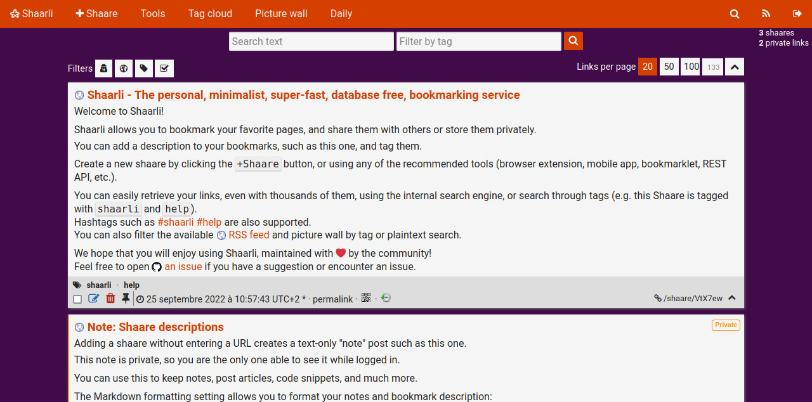

# User CSS for Shaarli's default theme

Customize the [Shaarli](https://github.com/shaarli/Shaarli)'s default theme.

## Prerequisites

Be sure the default theme is activated in `data/config.json.php`

    "theme": "default"

## Install

Clone the git repository

    git clone https://github.com/reinboldg/shaarli-default-theme-user-css.git

Copy a CSS file into the Shaarli's data directory

For example:

    cp halloween/user.css /var/www/shaarli/data/

## Extras

### Thumbnail

The `thumbnail` CSS class allows to display the images of the description field as thumbnails.

#### Prerequisites

Formatter

`formatter` must be `markdown` or `markdownExtra` in `data/config.json.php`

    "formatter": "markdown"

Security

`markdown_escape` must be disabled in `data/config.json.php`

    "security": {
        "markdown_escape": false,
        ...
    },

#### Usage

The best way to use `thumbnail` class is to set it to a `div` with `img` HTML tags

For example:

    Today is a beautiful day!
    
    

      
      
    

    
    Sample text in markdown

## Themes

Halloween

