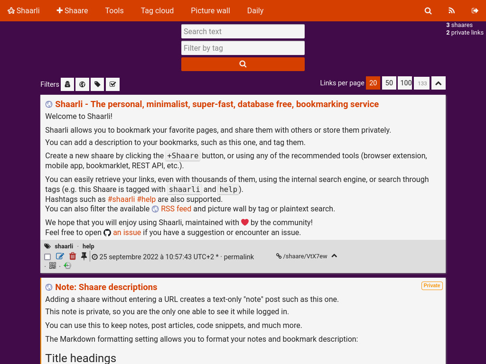

# User CSS for Shaarli's default theme

Customize the [Shaarli](https://github.com/shaarli/Shaarli)'s default theme.

## Prerequisites

Be sure the default theme is activated in `data/config.json.php`

    "theme": "default"

## Install

Clone the git repository

    git clone https://github.com/reinboldg/shaarli-default-theme-user-css.git

Copy a CSS file into the Shaarli's data directory

For example:

    cp halloween/user.css /var/www/shaarli/data/

## Themes

Halloween

